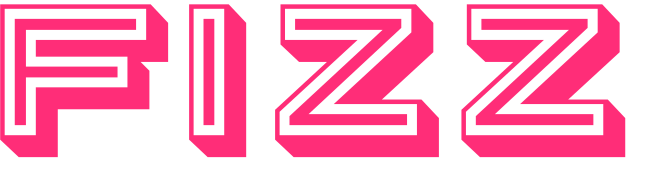

<p align="center">
  
</p>

<p align="center"><b>A lightweight, private browser-extension wallet for the Aztec network.</b></p>

<p align="center">
  Tokens with sparkle. Send and receive private tokens, flip balances between
  private and public, deploy your own token, and bridge fee juice. Keys and
  zero-knowledge proofs are generated and stay on your device.
</p>

<p align="center"><i>Alpha software, built for quick, low-value transactions. It is not a vault.</i></p>

---

## What is Fizz?

Fizz is a Chrome (MV3) extension wallet for [Aztec](https://aztec.network), the
privacy-first L2. The PXE (private execution environment) and the prover run
**in the browser**, so your seed, keys, and proofs never leave the device. The
wallet talks directly to an Aztec node you choose, including your own.

It ships with one companion page on [fizzwallet.com](https://fizzwallet.com):

- **/bridge** brings your own gas: bridge the AZTEC token from Ethereum L1 into
  fee juice on your connected account. The wallet generates the claim secret and
  auto-completes the claim, so there is no ticket to copy — the juice lands in
  your balance by itself.

Token creation happens **entirely in the wallet**: name it, pick a supply, and
deploy from the Deploy screen. Proving runs in the background while you keep
using the wallet — a status bar tracks it on every screen.

## Features

- **Private by default.** Amounts, senders, and recipients stay hidden on-chain.
- **Two balances, one tap.** Every token has a private and a public side; shield
  and unshield whenever you like.
- **Make your own token.** Deploy a standard AIP-20 token right in the wallet,
  mint privately or publicly, keep or drop the minter role.
- **Bring your own gas.** Bridge AZTEC into fee juice straight to your account.
- **Multiple accounts** from one recovery phrase, to keep activities unlinkable.
- **Encrypted vault.** Argon2id + AES-256-GCM; unlock with a passkey (WebAuthn
  PRF) or a passphrase. The seed is zeroized after use.
- **Bring your own node.** Point the wallet at any Aztec node, local or hosted.

## How it works

- **In-browser PXE + proving.** Runs inside an extension page, not the service
  worker (which Chrome kills on idle), using SharedArrayBuffer / WASM threads
  with the COOP/COEP headers the manifest sets.
- **Egress is pinned.** The manifest CSP `connect-src` allowlists only the Aztec
  node, the proving CRS CDN, and (in dev) localhost, so a compromised page has
  nowhere to exfiltrate a seed.
- **Address-blind dApp connect.** Sites connect to the wallet without learning
  your address; every transaction is confirmed in-wallet.

## Repository layout

| Path        | What |
|-------------|------|
| `src/`      | The browser extension: popup UI (`src/popup`), background worker (`src/background`), libs (`src/lib`: vault, aztec, state). |
| `public/`   | Extension static assets (logos served at `/`). |
| `web/`      | The fizzwallet.com web app: a single-page Vite + React SPA — the home and `/bridge`. The build emits per-route SEO shells into `web/dist`. |
| `tests/`    | Unit + property tests, plus live-network e2e and a real-Chrome smoke gate. |

## Develop

Requires Node 20+ and Yarn.

### Extension

```sh
yarn install
yarn build            # outputs dist/
```

Load it unpacked: open `chrome://extensions`, enable **Developer mode**, click
**Load unpacked**, and pick the `dist/` folder. Rebuild and hit reload to pick
up changes.

```sh
yarn typecheck        # tsc -b
yarn test             # unit + property (fast-check) tests, hermetic, no network
yarn verify           # frozen-lockfile install + typecheck + test + build
yarn package          # verify, then zip dist/ for the Web Store
```

Live-network tests (each gated by an env var so they never run by accident):

```sh
yarn test:e2e                                                                   # full lifecycle vs a local sandbox (aztec start --local-network)
TESTNET=1 yarn vitest run --project e2e tests/e2e/testnet.test.ts               # real proofs vs public testnet
BROWSER=1 yarn vitest run --project e2e tests/browser/extension-smoke.test.ts   # real Chrome, built MV3 package
```

The browser smoke test needs Chrome for Testing once:
`npx @puppeteer/browsers install chrome@stable`.

> The unit suite pins the mnemonic-to-account derivation vectors
> (`tests/unit/derivation.test.ts`). If those ever fail, do **not** update the
> expectations: a derivation change would strand every existing user's funds.

### Web app (fizzwallet.com)

```sh
cd web
yarn install
yarn build            # SPA into web/dist (+ per-route SEO shells), served on Railway
yarn dev              # local dev server
```

The `/bridge` page connects an Ethereum wallet — **MetaMask or Rabby only**
(injected / EIP-6963). There is no WalletConnect, so no project id or env var is
needed. Deployment is the repo-root `Dockerfile` (builds `web/`, serves
`web/dist` with the security headers in `web/public/serve.json`).

## Security

Keys and proofs never leave your device, the vault is encrypted at rest, and
cross-origin pages can neither read wallet storage nor learn your address. That
said: this is **alpha** software for **low-value** use. Do not keep more in it
than you would carry in a pocket. Bridging is a public L1 action that links your
Ethereum address to the funded Aztec address; fund from a fresh or exchange
address if you want it unlinkable.

Found a vulnerability? Please open a private report rather than a public PoC.

## License

[MIT](LICENSE) © rolldavid
